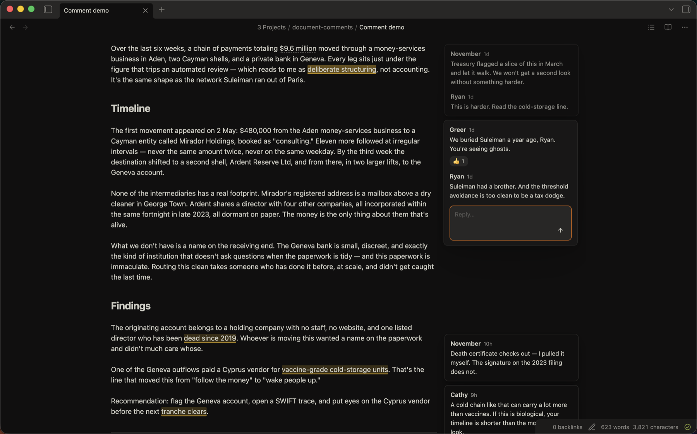

# Document Comments

Notion / Linear-style **margin comments** for Obsidian — except the comments live **inside the markdown file**, stored as HTML comments. They render as floating cards in the right margin, but any other tool or AI agent that reads the raw `.md` sees them in context (a comment-free editor, a `git diff`, or an LLM all read the same thing).



> Available in Obsidian's **Community plugins** store, on **desktop and mobile** — see [Install](#install).

## Features

- **Inline storage.** Comments are plain HTML comments in the file — invisible in Reading view and in other markdown renderers, and legible to agents/tools that read the raw text.
- **Margin cards** in Live Preview, Source, and Reading view, aligned to the highlighted text. Click a card to jump to its anchor; hover to light it up.
- **Threads, resolve / reopen, emoji reactions, edit & delete** — every action is a plain edit to the markdown, so it round-trips cleanly.
- **Markdown in comment text** — code spans, bold, links, lists, etc. render in the cards (margin and sidebar).
- **Long comments collapse** to a *Show more* preview; a thread taller than the screen opens in the sidebar instead.
- **Inline composer.** Select text → command or right-click → a draft card opens in the margin (no modal). On mobile, a small dialog takes its place.
- **"All discussions" sidebar** — a panel listing the active note's comments with **Open / Resolved / All** filter tabs; while it's open the inline cards step aside (the in-text highlights stay).
- **Toggle comments** on/off (also hides the text highlights), and **hide resolved** comments by default.
- **Mobile.** On phones and tablets the floating margin is turned off (there's no room for it): the in-text **highlights** still mark commented text, and you read, reply, and resolve through the **sidebar** panel — new comments are composed in a quick dialog. It's the same inline storage, so a note's comments are identical on desktop and mobile.

## How comments are stored

```markdown
We should <!--c:k3f9-->ship on Friday<!--/c:k3f9--> regardless of the QA timeline.
<!--co:k3f9 by:kyle at:2026-06-17T10:00:00.000Z status:open quote:"ship on Friday"
kyle (2026-06-17T10:00:00.000Z): I thought we agreed Thursday?
sam (2026-06-17T10:05:00.000Z): Thursday is better for QA.
-->
```

`<!--c:ID-->…<!--/c:ID-->` delimits the highlighted span; `<!--co:ID …-->` holds the thread. An agent can list comments by scanning for `<!--co:`, and find the referenced text via the matching `<!--c:ID-->` span or the redundant `quote:` value. The markers are HTML comments, so they don't render anywhere except this plugin.

## Install

Requires **Obsidian 1.7.2 or newer** (desktop or mobile).

### Community plugins (recommended)

1. Open **Settings → Community plugins → Browse**.
2. Search for **Document Comments**, click **Install**, then **Enable**.

### BRAT — for pre-release builds

1. Install **BRAT** (Settings → Community plugins → Browse → search "BRAT") and enable it.
2. Run the command **BRAT: Add a beta plugin for testing** and enter:
   `kylemcd/obsidian-document-comments`
3. Enable **Document Comments** in Settings → Community plugins.

BRAT installs from the latest GitHub release and updates it automatically when new ones ship.

### Manual

1. Download `main.js`, `manifest.json`, and `styles.css` from the [latest release](https://github.com/kylemcd/obsidian-document-comments/releases).
2. Drop them in `<your-vault>/.obsidian/plugins/document-comments/` (create the folder).
3. In Obsidian, reload (or restart), then enable **Document Comments** under Settings → Community plugins.

### Build from source

```bash
git clone https://github.com/kylemcd/obsidian-document-comments
cd obsidian-document-comments
npm install
npm run build
```

Then copy (or symlink) `main.js`, `manifest.json`, and `styles.css` into
`<your-vault>/.obsidian/plugins/document-comments/` and enable the plugin.

## Usage

- **Add a comment:** select text, then run **Add comment on selection** (command palette) or right-click → **Add comment**. Type in the margin card and press Enter (Shift+Enter for a newline).
- **Reply / resolve / react / edit / delete:** hover a card to reveal its action bar, or use the ⋯ menu.
- **Open the sidebar:** the *Open comments sidebar* ribbon icon or command.
- **Show/hide comments and resolved:** the ribbon, or the *Toggle comments* / *Toggle resolved comments* commands.

Set the name attached to your comments under **Settings → Document Comments → Author**.

## Privacy

No network use, no telemetry, no accounts. Everything stays in your vault.

## Known limitations

- On **mobile**, the floating margin column is turned off (there's no room for it). Comments are read and managed through the **sidebar** instead — highlights still mark the text, and new comments are composed in a dialog. Same inline storage, so it round-trips with desktop.
- Comments whose highlighted text **overlaps** another comment's are stored fine but are a rough edge; avoid stacking comments on the same words for now.
- In **Live Preview**, the highlight doesn't show on text inside a **table** (Obsidian renders tables as a self-contained widget the highlight can't reach). The comment and its card still work, and the highlight shows in **Reading view** and **Source mode**.

## Development

```bash
npm install
npm run dev      # esbuild watch → main.js
npm run build    # typecheck + production bundle
npm run check    # oxfmt + oxlint + eslint + tsc + vitest
npm test         # vitest
```

**Releasing.** Pushing a version tag (e.g. `git tag 0.1.1 && git push origin 0.1.1`) runs [`.github/workflows/release.yml`](.github/workflows/release.yml): it builds the plugin, generates GitHub [artifact attestations](https://docs.github.com/actions/security-guides/using-artifact-attestations-to-establish-provenance-for-builds) for the release assets, and publishes the release (and fails fast if the tag doesn't match `manifest.json`'s version). Verify a downloaded asset with `gh attestation verify main.js --repo kylemcd/obsidian-document-comments`.

## License

MIT — see [LICENSE](LICENSE).
